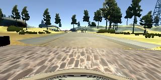

# Behaviorial Cloning Project

[](http://www.udacity.com/drive)

The goals/steps of this project are the following:

* Use the simulator to collect data of good driving behavior
* Build, a convolution neural network in Keras that predicts steering angles from images
* Train and validate the model with a training and validation set
* Test that the model successfully drives around track one without leaving the road
* Summarize the results with a written report

## Files Submitted & Code Quality

### 1. Submission includes all required files and can be used to run the simulator in autonomous mode

My project includes the following files:

* model.py containing the script to create and train the model
* drive.py for driving the car in autonomous mode
* model.h5 containing a trained convolution neural network
* README.md summarizing the results

### 2. Submission includes functional code

Using the Udacity provided simulator and my drive.py file, the car can be driven autonomously around the track by executing

```sh
python drive.py model.h5
```

### 3. Submission code is usable and readable

The model.py file contains the code for training and saving the convolution neural network. The file shows the pipeline I used for training and validating the model, and it contains comments to explain how the code works.

## Model Architecture

### 1. An appropriate model architecture has been employed

The model consists of a convolution neural network with 5x5 and 3x3 filter sizes and depths between 24 and 64 (model.py lines 211-247).

The model includes 5 RELU layers to introduce nonlinearity (model.py line 221), and the data is normalized in the model using a Keras lambda layer (model.py line 213).
The input images are cropped using a Keras Cropping2D layer (model.py line 217).
The model includes 4 TANH activation layers, so the output of the network fits the expected steering angles [-1..1] (model.py line 239).

### 2. Attempts to reduce overfitting in the model

The model contains 5 dropout layers and 3 max pooling layers in order to reduce overfitting (model.py lines 229).

The model was trained and validated on different data sets to ensure that the model was not overfitting.
The model was tested by running it through the simulator and ensuring that the vehicle could stay on the track.
With 9mph this goal could be easily reached.
Increasing the speed to 20mph, the car starts oscilating because the latency between image capturing, processing and reaction was not considered in the network.
This can be improved, by changing the dataset.
The dataset should be updated, to map the images with steering angles some fixed amount of images after the current image.
So the neural network learns to handle the latency.

### 3. Model parameter tuning

The model used an adam optimizer, so the learning rate was not tuned manually (model.py line 249).

### 4. Appropriate training data

Training data was chosen to keep the vehicle driving on the road. A combination of center lane driving, recovering from the left and right sides of the road.
Additionally image augmentation (flipping, rotation, zooming) was used to increase the training samples and harden the neural network (model.py lines 85 - 120).

For details about how I created the training data, see the next section.

## Training Strategy

### 1. Solution Design Approach

The overall strategy for deriving a model architecture was to have some convolutional layers followed by some dense layers.

The first step was to use a convolution neural network model similar to the AlexNet.
This model might be appropriate because it also classifies a large number of image classes and therefore has to understand the image quite well.

In order to gauge how well the model was working, the image and steering angle data was split into a training and validation set.
That first model had a high mean squared error on the training set as well as on the validation set.
This implied that the model maybe has to less parameters, so the model was increased.

This model then had a low mean squared error on the training set but a high mean squared error on the validation set.
This implied that the model was overfitting.

To combat the overfitting, the model was modified and some dropout and max pooling layers were added.

The final step was to run the simulator to see how well the car was driving around track one.
With 9mph the car drove savely and confident in the middle of the track.
Increasing to 20mph resulted in the above mentioned problems.

At the end of the process 1-2 epochs were needed to train a model, which is able to drive the vehicle autonomously around the track without leaving the road.

A test on the track two resulted in an offtrack situation within 10 meters or so.

Then some sample data from the track two was collected and the existing model was trained on this new data.
In terms of transfere learning, the existing model was reused with its weights and trained end-to-end.

Another test on the track two resulted in a bit better drive, but the car got offtrack at least after approximatelly 100 meters.

At the end the network was not able to drive the track two for at least some more meters.
I guess more training data and maybe also a bigger network is needed for that challenge.

### 2. Final Model Architecture

The final model architecture (model.py lines 211-247) consisted of a convolution neural network with the following layers and layer sizes:

| Layer (type)    | Output Shape          | Param #   | Notes                |
| --------------- | --------------------- | --------: | -------------------- |
| Lambda          | (None, 160, 320, 3)   | -         | normalization        |
| Cropping2D      | (None, 90, 320, 3)    | -         |                      |
| Convolution2D   | (None, 86, 316, 24)   | 1824      |                      |
| MaxPooling2D    | (None, 43, 158, 24)   | -         |                      |
| Activation      | (None, 43, 158, 24)   | -         | RELU                 |
| Convolution2D   | (None, 39, 154, 32)   | 19232     |                      |
| MaxPooling2D    | (None, 19, 77, 32)    | -         |                      |
| Activation      | (None, 19, 77, 32)    | -         | RELU                 |
| Convolution2D   | (None, 15, 73, 48)    | 38448     |                      |
| MaxPooling2D    | (None, 7, 36, 48)     | -         |                      |
| Activation      | (None, 7, 36, 48)     | -         | RELU                 |
| Convolution2D   | (None, 5, 34, 64)     | 27712     |                      |
| Dropout         | (None, 5, 34, 64)     | -         | dropout_prob = 0.5   |
| Activation      | (None, 5, 34, 64)     | -         | RELU                 |
| Convolution2D   | (None, 3, 32, 64)     | 36928     |                      |
| Dropout         | (None, 3, 32, 64)     | -         | dropout_prob = 0.6   |
| Activation      | (None, 3, 32, 64)     | -         | RELU                 |
| Flatten         | (None, 6144)          | -         |                      |
| Dense           | (None, 128)           | 786560    |                      |
| Dropout         | (None, 128)           | -         | dropout_prob = 0.6   |
| Activation      | (None, 128)           | -         | TANH                 |
| Dense           | (None, 64)            | 8256      |                      |
| Dropout         | (None, 64)            | -         | dropout_prob = 0.4   |
| Activation      | (None, 64)            | -         | TANH                 |
| Dense           | (None, 32)            | 2080      |                      |
| Dropout         | (None, 32)            | -         | dropout_prob = 0.3   |
| Activation      | (None, 32)            | -         | TANH                 |
| Dense           | (None, 1)             | 33        |                      |
| Activation      | (None, 1)             | -         | TANH                 |

Total params: 921,073
Trainable params: 921,073
Non-trainable params: 0

### 3. Creation of the Training Set & Training Process

To capture good driving behavior, first one lap and one lap reversed on track one was recorded using center lane driving. Here is an example image of center lane driving:



Afterwards some sample data from the track two was recorded, so that the vehicle would learn to abstract the environment.
These images show examples:


<!--  -->
<!--  -->

To augment the dataset, the images and angles were flipped thinking that this would remove the bias to one side within the training set.

After the collection process, there were 1,597,590 of data points.
Afterwards the data was preprocessed by normalizing the image values and cropping the image to a region of interest.

Finally the data set was randomly shuffled and 20% of the data were put into a validation set.

This training data was used for training the model.
The validation set helped determine if the model was over or under fitting.
The ideal number of epochs was 2 as evidenced by the stagnating validation loss.
An adam optimizer was used so that manually training the learning rate wasn't necessary.

The training was started using all images (including all aumented images) per epoch.
It was trained 3 epochs using only the images in the ```data```-folder from the GitHub repo.
Afterwards it was trained one more epoch on all the training set described above (also the newly recorded data sets).
This was enough to drive the vehicle with 9mph and 20mph through the track one of the simulator.


Until now the model was not able to drive the track two of the simulator.
Transfere learning was applied to make the model be able to drive the track two.
The model was loaded with all its weights from the previous trainings and trained on the complete training set.
The images per epoch parameter was devided by 30, so the graph shows more details while training.
This results in training the model for 30 epochs, is the same as having the model trained for 1 epoch without the devision.
So the model was trained 4 complete epochs before loading it from distk again and from then on it was trained with 1/30 epochs.

This means the code was changed from: (including all augmented images)

```python
history = model.fit_generator(train_generator,
    samples_per_epoch=len(train_samples)*90,
    validation_data=validation_generator,
    nb_val_samples=len(validation_samples)*90,
    nb_epoch=FLAGS.epochs,
    callbacks=[es, cp, lc])
```

to: (using only a part of the whole data set per epoch)

```python
history = model.fit_generator(train_generator,
    samples_per_epoch=len(train_samples)*3,
    validation_data=validation_generator,
    nb_val_samples=len(validation_samples)*3,
    nb_epoch=FLAGS.epochs,
    callbacks=[es, cp, lc])
```

without changing the size of the training set or the augmentation script.

After another 20 (20/30) epochs on the complete data set, I decided to train the model on only on the ```data/challenge```-folder, because the network did not make any improvements on the track two.

The training data of the track two (challenge) does not include samples from the whole track.
This is an extra validation, if the model correctly abstracts the image contents.

After training it for about another 30 (30/30) epochs on the reduced data set, the vehicle was able to drive most of the track two.
Transfere learning was successfull.
It got off-track in a very tight curve.
There should be more training data on tight curves, so the network learns to drive them too.

The reason why the model was not able to drive track two when training the whole data set, might be because the track two traning set is only a fraction of the total training set.
So the bias of the training set is on the track one.
The network was not able to learn enough from the combined traning set, so it was able to drive both tracks.

After the model was only trained on the track two images, it was not able to drive track one anymore.

Here is a graph of the hole training.
After epoch 20 the training loss jups to approximatily 0.1 because the dataset was changed.


```sh
# 4 epochs
python drive.py model.h5 video_9mph
# 4 epochs
python drive.py model.h5 video_20mph
# 6 epochs
python drive.py model_challenge.h5 video_challenge_9mph
```

## Dependencies

This lab requires:

* [CarND Term1 Starter Kit](https://github.com/udacity/CarND-Term1-Starter-Kit)

The lab enviroment can be created with CarND Term1 Starter Kit. Click [here](https://github.com/udacity/CarND-Term1-Starter-Kit/blob/master/README.md) for the details.

### Simulator Download

* [Linux](https://d17h27t6h515a5.cloudfront.net/topher/2017/February/58ae46bb_linux-sim/linux-sim.zip)
* [macOS](https://d17h27t6h515a5.cloudfront.net/topher/2017/February/58ae4594_mac-sim.app/mac-sim.app.zip)
* [Windows](https://d17h27t6h515a5.cloudfront.net/topher/2017/February/58ae4419_windows-sim/windows-sim.zip)

If you are interested here is the source code for the [simulator repository](https://github.com/udacity/self-driving-car-sim).

## Sample Training Data

[Sample Training Data](https://d17h27t6h515a5.cloudfront.net/topher/2016/December/584f6edd_data/data.zip)

## Details About Files In This Directory

### `drive.py`

Usage of `drive.py` requires you have saved the trained model as an h5 file, i.e. `model.h5`. See the [Keras documentation](https://keras.io/getting-started/faq/#how-can-i-save-a-keras-model) for how to create this file using the following command:

```sh
model.save(filepath)
```

Once the model has been saved, it can be used with drive.py using this command:

```sh
python drive.py model.h5
```

The above command will load the trained model and use the model to make predictions on individual images in real-time and send the predicted angle back to the server via a websocket connection.

Note: There is known local system's setting issue with replacing "," with "." when using drive.py. When this happens it can make predicted steering values clipped to max/min values. If this occurs, a known fix for this is to add "export LANG=en_US.utf8" to the bashrc file.

#### Saving a video of the autonomous agent

```sh
python drive.py model.h5 run1
```

The fourth argument, `run1`, is the directory in which to save the images seen by the agent. If the directory already exists, it'll be overwritten.

```sh
ls run1

[2017-01-09 16:10:23 EST]  12KiB 2017_01_09_21_10_23_424.jpg
[2017-01-09 16:10:23 EST]  12KiB 2017_01_09_21_10_23_451.jpg
[2017-01-09 16:10:23 EST]  12KiB 2017_01_09_21_10_23_477.jpg
[2017-01-09 16:10:23 EST]  12KiB 2017_01_09_21_10_23_528.jpg
[2017-01-09 16:10:23 EST]  12KiB 2017_01_09_21_10_23_573.jpg
[2017-01-09 16:10:23 EST]  12KiB 2017_01_09_21_10_23_618.jpg
[2017-01-09 16:10:23 EST]  12KiB 2017_01_09_21_10_23_697.jpg
[2017-01-09 16:10:23 EST]  12KiB 2017_01_09_21_10_23_723.jpg
[2017-01-09 16:10:23 EST]  12KiB 2017_01_09_21_10_23_749.jpg
[2017-01-09 16:10:23 EST]  12KiB 2017_01_09_21_10_23_817.jpg
...
```

The image file name is a timestamp of when the image was seen. This information is used by `video.py` to create a chronological video of the agent driving.

### `video.py`

```sh
python video.py run1
```

Creates a video based on images found in the `run1` directory. The name of the video will be the name of the directory followed by `'.mp4'`, so, in this case the video will be `run1.mp4`.

Optionally, one can specify the FPS (frames per second) of the video:

```sh
python video.py run1 --fps 48
```

Will run the video at 48 FPS. The default FPS is 60.

#### Why create a video

1. It's been noted the simulator might perform differently based on the hardware. So if your model drives succesfully on your machine it might not on another machine (your reviewer). Saving a video is a solid backup in case this happens.
2. You could slightly alter the code in `drive.py` and/or `video.py` to create a video of what your model sees after the image is processed (may be helpful for debugging).

### Tips

* Please keep in mind that training images are loaded in BGR colorspace using cv2 while drive.py load images in RGB to predict the steering angles.
